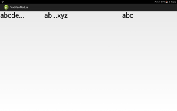
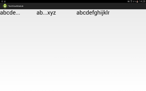

# TextViewModule
字數過多應變模組


##開發動機
傳統的TextView當內容字過長時，往往會產生部分文字被截斷的問題，於是我們決定開發此模組，利用文字提示及跑馬燈的方式讓使用者能一目了然


這個模組提供了三個方法解決

1.在過長的字體去掉，後面加上"…" 

2.只留下頭尾，在中間加上"…"

3.將字串變成跑馬燈

##示意圖

   


##使用說明

###先選擇模式

* DOT_LAST："…"在後方

* DOT_CENTER："…"在中間

* RUNNING_TEXT：跑馬燈


###DOT_LAST模式的程式碼如下：

* getLetterWidth : 用來取得單一個字的寬度

* textWholeLength : 用來記錄在"…"之前的字串長度

* 使用者只要將字串跟想要的字體大小傳入就會自動幫你印好

```
// 判斷字長度是否超出範圍，有就顯示"..."在字的後面
      if (yourTextWidth > (this.allWidth - getDotTextWidth())) {
        letters = yourText.split("");
        textLength = (int) ((float) (this.allWidth - getDotTextWidth()) / getLetterWidth("W"));
        for (int i = 0; i < textLength; i++) {
          textWholeLength = 0;
          // 由於每個字占的寬度不同，所以要先算好"..."前字的長度
          for (int j = 0; j < i; j++) {
            textWholeLength = textWholeLength
                + getLetterWidth(letters[j]);
          }
          canvas.drawText(letters[i], 0 + textWholeLength,
              0 + this.paintText.getCurrent(), paintText);

          textWholeLength = textWholeLength
              + getLetterWidth(letters[i]);
        }
        // 最後印上"..."
        canvas.drawText("...", 0 + textWholeLength,
            0 + this.paintText.getCurrent(), paintText);
      } else {
        canvas.drawText(yourText, 0, 0 + this.paintText.getCurrent(),
            paintText);
      }

      // 計算單一個字長度
      private float getLetterWidth(String letter) {
          PaintText pText = new PaintText(letter);
          pText.setTextSize(yourTextSize);
          return pText.getWidth();
      }
```

###DOT_CENTER模式程式碼如下：

* 將整個TextView分成三個區塊，中間的"…"、"…"前的字串寬度、"…"後的字串寬度

* 一樣先將字串中每個字的寬度算好再分別將上面的三個區塊照順序印出(e.g. AAA…BBB)

* 使用者只要傳入想要顯示的字串和欲設定的字體大小即可


```
// 判斷字長度是否超出範圍，有就顯示"..."在字串的中間
      if (yourTextWidth > (this.allWidth - getDotTextWidth())) {
        letters = yourText.split("");
        textLength = (int) ((float) (this.allWidth - getDotTextWidth()) / getLetterWidth("W"));
        // 先印前半段文字，作法同"..."在後方
        for (int i = 0; i < textLength / 2; i++) {
          textWholeLength = 0;
          for (int j = 0; j < i; j++) {
            textWholeLength = textWholeLength
                + getLetterWidth(letters[j]);
          }
          canvas.drawText(letters[i], 0 + textWholeLength,
              0 + this.paintText.getCurrent(), paintText);
          textWholeLength = textWholeLength
              + getLetterWidth(letters[i]);
        }
        // 接著印上"..."
        canvas.drawText("...", 0 + textWholeLength,
            0 + this.paintText.getCurrent(), paintText);
        textWholeLength = textWholeLength + getLetterWidth("...");
        // 最後印後面的文字
        for (int i = textLength / 2; i < textLength; i++) {
          // 依照計算的長度印上字
          canvas.drawText(letters[letters.length
              - (textLength - textLength / 2)
              + (i - textLength / 2)], 0 + textWholeLength,
              0 + this.paintText.getCurrent(), paintText);
          // 拿出最後幾個字先計算長度
          textWholeLength = textWholeLength
              + getLetterWidth(letters[letters.length
                  - (textLength - textLength / 2)
                  + (i - textLength / 2)]);
          
        }
      } else {
        canvas.drawText(yourText, 0, 0 + this.paintText.getCurrent(),
            paintText);
      }

```


###跑馬燈

* 跑馬燈是藉由改變字串的X軸起始位置的方式來做

* 模組當中有提供傳入X軸位置的方法

```
// 設定跑馬燈的位置
  public void setXPosition(float xPosition) {
    this.xPosition = xPosition;
    if (xPosition < 0 - getCalYourTextWidth()) {
      this.xPosition = 0 + getWidth();
    }
    invalidate();
  }
```

* 只要使用執行續依照時間改變X軸起始位置就可以達到跑馬燈的效果

```
private Runnable run = new Runnable() {
    public void run() {
      running.setXPosition(running.getXPosition() - 5);
      handler.postDelayed(run, 100);
    }
  };
```


